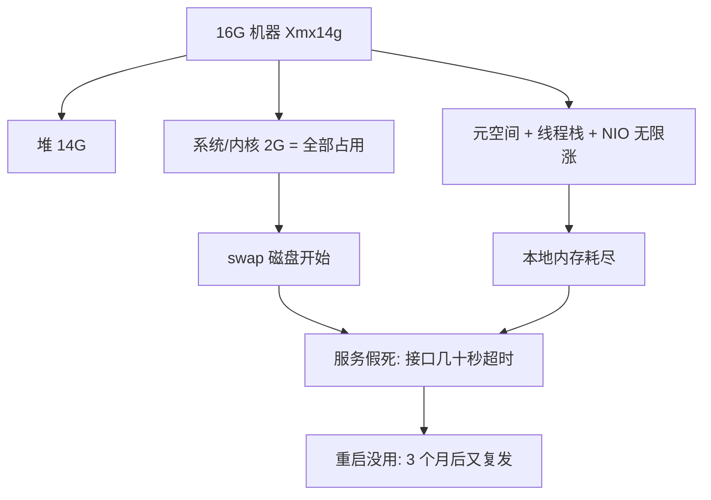

# 技术详解：JVM 参数配置实战 —— 16G 内存 / 2 核 CPU

> 适用：面试必考题（赛微面试已中）+ 生产落地。本讲从**物理内存分账 → 堆结构 → GC 选型 → 堆外内存 → 线上排查 → 容器坑**一条链路讲透，每个参数都讲"为什么"，最后给可直接照抄的配置模板 + 面试连环追问答案。
> 全程用电商订单系统贯穿（业务字段都是真的）。

---

## 〇、30 秒速记卡（先背这个，下面再讲透）

```
16G/2核 核心判断：CPU 才是瓶颈，不是内存。
                        ┌ 堆: 6~8G（-Xms=-Xmx，锁死防动态扩容）
16G 物理内存分账 → ├ 元空间: MaxMetaspaceSize 512m（不设=本地内存无限涨）
                        ├ 系统+其他进程: 2~3G
                        └ 缓冲/堆外: 2~3G（防 swap）
GC 选型：堆 6G+ 用 G1（MaxGCPauseMillis=200）
         堆 4G 用 Parallel（JDK8 默认，2核下更省）
线上必备：-XX:+HeapDumpOnOutOfMemoryError  + GC 日志  + 容器锁 -Xmx
金句："堆不是越大越好——堆越大 Full GC 停得越久，2 核下更久。"
```

> 🔑 **面试金句（直接背）**："16G/2 核的机器，JVM 配置的抓手不是把内存用满，而是**在 2 核的 CPU 预算下让 GC 停顿可控**。我会把堆锁在 6-8G，剩下留给元空间、线程栈、Direct 内存和操作系统——堆外内存不吃够，堆再大也是纸上谈兵。"

---

## 一、先讲"为什么"：这道题背后是两起真实事故

面试官问"16G/2核 JVM 怎么配"，不是考你背参数，是看你**有没有配崩过的认知**。先推演两起事故，你就懂每个参数为什么存在。

### 事故 A：16G 机器 Xmx14g，三个月后服务假死



**事故链**：Xmx14g 看着"把 16G 用足了"，但**堆不是唯一吃内存的东西**——操作系统、元空间（类元信息）、每个线程的栈、NIO/Direct 内存（连接池、Netty、ES 客户端）、以及同机可能的中间件，全都要从剩下 2G 里挤。挤不下的部分被挤到 **swap**（磁盘换页），磁盘 I/O 比内存慢几个数量级 → 接口从几毫秒变成几十秒 → 服务假死。而且元空间不设上限时会无限涨（类加载器泄漏时），本地内存悄悄耗尽。

**教训**：**堆是 JVM 内存的一部分，不是全部。16G 不是"给堆 16G"，是"16G 里给堆分一份"。**

### 事故 B：容器 limit 2G，配了 -Xmx8g，容器被 OOM Killed

JDK 8（**8u191 之前**）默认**不识别容器**（cgroup）的内存限制，JVM 启动时读的是**宿主机的物理内存**。宿主机 16G → JVM 以为有 16G 可用 → 你以为配了 `-Xmx8g` 没问题，其实容器 limit 只有 2G → 堆涨到 2G 就把容器打爆 → **进程被内核 OOM Killed，连 dump 都来不及**。

**教训**：容器里配 JVM，第一件事是确认 JVM 版本认不认 cgroup（`-XX:+UseContainerSupport`，8u191+/9+ 默认开），并且**永远显式配 -Xmx**，绝不依赖 JVM 自动算。

> 这两起事故就是"为什么堆不能贪大"和"为什么容器要显式锁 Xmx"的答案。下面逐个参数拆。

---

## 二、第一性原理：16G 物理内存怎么分账（这是总纲）

16G 物理内存 ≠ 16G 给 JVM。合理的分账（单 JVM 独占，无同机中间件）：

| 预算项 | 大小 | 为什么留这份 |
|--------|:----:|------|
| 操作系统 + 内核 | 1.5-2G | 内核、系统服务、**页缓存**（文件读写要它） |
| **JVM 堆** | **6-8G** | 对象实例都在这，主战场 |
| 元空间（MaxMetaspaceSize） | 0.5G | 类元信息，不设上限会吃光本地内存 |
| 线程栈 + Direct/NIO + 连接池 | 1-2G | 每个线程 1M 栈，100 线程=100M；Netty/ES 客户端吃 Direct |
| **缓冲（防 swap）** | **2-3G** | 以上任何一块预估不准，靠它兜底，保证不碰 swap |

```
16G 物理内存分账（ASCII）:
┌─────────────────────────────────────────────────────────────┐
│ 16G 物理内存                                                    │
│ ┌──────────────┐ ┌──────────────┐ ┌────────┐ ┌───────────┐  │
│ │ JVM 堆 6-8G  │ │ 元空间 0.5G  │ │系统+其他│ │ 缓冲 2-3G │  │
│ │ (对象主战场)  │ │ (类元信息)   │ │1.5-2G  │ │ (防swap)   │  │
│ └──────────────┘ └──────────────┘ └────────┘ └───────────┘  │
└─────────────────────────────────────────────────────────────┘
    ↑ 重点看：堆只占 40-50%，不是 90%。堆外吃不饱，堆大也是空转。
```

### 🔑 2 核才是真正的瓶颈（这段话是整讲的题眼）

同样的 16G 内存，**8 核和 2 核的 JVM 配置逻辑完全不同**。为什么？

**GC 停顿时间 ≈ 堆大小 ÷ 回收速率**。回收速率由 CPU 决定——GC 也是要 CPU 算的（可达性分析要遍历对象图、复制要搬对象）。2 核机器上：

- GC 线程和业务线程**抢 CPU**：2 个核，业务跑 1 个、GC 跑 1 个，业务吞吐直接砍半。
- 堆越大，一次 GC 要扫描/搬运的对象越多 → **停顿越久**。8 核下 Full GC 扫 8G 堆可能 500ms，2 核下要 2-3 秒。
- 结论：**2 核机器，宁可堆小一点（6G 而不是 8-10G），用"少回收"换"短停顿"。** 堆配得再大，CPU 算不过来，停顿反而把吞吐吃光。

> 这也是为什么面试官特意说"16G **2核**"——故意埋了 CPU 这个坑。你只答内存分账不答 CPU 权衡，就是没看到题眼。

---

## 三、堆内参数：-Xmx / -Xms / NewRatio / SurvivorRatio（每个为什么）

### 3.1 -Xms 与 -Xmx：必须相等

```
-Xms6g -Xmx6g        # 初始堆 = 最大堆，锁死
```

**为什么锁死（Xms = Xmx）**：
1. **动态扩容 = Full GC = STW（Stop-The-World，停止所有业务线程的全局停顿）**。堆从 4G 扩到 8G 的过程要触发 GC、重新分配内存，这是线上最不受欢迎的停顿来源。
2. 内存碎片 + 分配器抖动。锁定后 JVM 启动就向 OS 申请满，运行期不再动。
3. OOM 行为可预测：锁死后，堆用满只会 OOM（可 dump），不锁死会先扩堆再 OOM（现场被破坏，更难排查）。

**误区纠正**：不要以为"Xms 小、Xmx 大 = 内存用多少给多少很省"。省下来的那点内存，换来的是运行中 N 次 Full GC 停顿 + 更难的排查。**生产必须相等**，这是阿里规约白纸黑字。

### 3.2 新生代 / 老年代：NewRatio 与 SurvivorRatio

```
-XX:NewRatio=2            # 老年代:新生代 = 2:1（默认），8G 堆 → 新生代 2.6G / 老年代 5.4G
-XX:SurvivorRatio=8       # Eden:S0:S1 = 8:1:1（默认）
```

**为什么默认 2:1（新生代占 1/3）**：大多数对象**朝生夕死**。电商订单系统里，每次下单创建的 `OrderRequest` DTO、`OrderController` 的局部对象、日志对象——一次请求结束就没人引用了，就该在**新生代的 Minor GC** 里被回收。新生代大一点 → 对象在新生代多活几轮 → **晋升到老年代的少 → 老年代不容易满 → Full GC 次数少**。

**但 2 核下新生代不是越大越好**：新生代越大，一次 Minor GC 要处理的存活对象越多，**停顿越长**。2 核下尤其明显。这就是为什么 NewRatio 默认 2，而不是 1 或 3——取"少 Full GC"和"短 Minor GC"的平衡。

**SurvivorRatio=8（Eden:S0:S1 = 8:1:1）为什么**：
```
8G 堆, NewRatio=2 → 新生代 2.6G, 老年代 5.4G
新生代内部（SurvivorRatio=8）:
┌───────────────────────────────┐
│ Eden 2.08G                    │ ← 新对象都在这
├──────────────┬────────────────┤
│ S0 0.26G     │ S1 0.26G       │ ← 两个幸存区轮流用
├──────────────┴────────────────┤
│ 老年代 5.4G                    │ ← 活过 15 次 GC 的对象晋升到这
└───────────────────────────────┘
    ↑ 看两点：Eden 是主战场（占新生代 80%）；S0/S1 各一份才能"复制算法"
```
- **复制算法要求留一个空的幸存区**：Minor GC 时把 Eden + S0 里还活着的对象复制到空着的 S1，然后清空 Eden + S0，下一轮 S0/S1 角色互换。所以必须留一块空的，S0:S1 = 1:1。
- **S0/S1 太小 → 放不下存活对象 → 对象提前晋升到老年代 → 老年代过早满 → Full GC 变多**。S0/S1 太大 → 浪费（大部分时间空着）。
- 8:1:1 是实践折中。**晋升过快要调大 Survivor**（SurvivorRatio 改 6/7）；Minor GC 频繁但堆没满，要调大 Eden（改 NewRatio 或直接加 -Xmn）。

### 3.3 -Xmn：显式指定新生代（可选，替代 NewRatio）

```
-Xmn2g        # 显式锁新生代 2G。比 NewRatio 直观，但写死大小、不随堆缩放
```

NewRatio 是"比例"，Xmn 是"绝对值"。**推荐用 NewRatio**：调 -Xmx 时新生代自动跟着缩放，不用改两处。Xmn 只在"我要锁死新生代"时用。

### 3.4 -XX:MaxTenuringThreshold：晋升年龄

```
-XX:MaxTenuringThreshold=15     # 默认 15，对象活过 15 次 Minor GC 才晋升
```

**为什么有年龄**：对象不是活一轮就该进老年代——很多对象只是"活了几毫秒"和"活了几分钟"的区别。年龄计数器：每熬过一次 Minor GC +1，到阈值晋升。

**动态晋升（实际生产中很常见）**：即使没到 15，如果 Survivor 区快满（占超过 `-XX:TargetSurvivorRatio`，默认 50%），存活对象会**提前晋升**——因为 Survivor 放不下了。所以别死记"必须 15 次"。

**误区**：MaxTenuringThreshold 不是调越大越好。调大 = 对象在 Survivor 里多复制几轮（复制是开销），调小 = 更早晋升（老年代涨更快）。默认 15 在多数场景够用，**改它之前先看 GC 日志**：如果对象在 Survivor 反复复制（`survivor` 区占用高、晋升量小），再考虑调大；如果晋升量大，调小没用，要调大 Survivor。

### 3.5 -XX:PretenureSizeThreshold：大对象直接进老年代

```
-XX:PretenureSizeThreshold=1m    # 超过 1MB 的对象直接进老年代（仅 Parallel/Serial 有效）
```

**为什么**：大对象（比如电商系统的 `List<OrderDTO>` 大列表、大 byte[] 图片缓冲）在新生代的 Eden/Survivor 之间复制很贵（复制大对象内存带宽高）。干脆直接放老年代，避开复制。**G1 不认这个参数**（G1 有 humongous region 概念，大于 Region 一半的对象叫巨型对象，直接占连续 Region）。

---

## 四、GC 收集器选型：Parallel vs G1（2核/16G 怎么选）

### 4.1 先记一个坑：JDK 版本默认收集器不一样

| JDK | 默认收集器 | 影响 |
|-----|-----------|------|
| JDK 8 | **Parallel GC**（并行回收） | 你显式写 `-XX:+UseG1GC` 才用 G1 |
| JDK 9+ | **G1 GC** | 默认就是 G1，不用写 |

**面试坑**：答"JDK 8 默认 G1" → 扣分。JDK 8 默认是 Parallel，G1 要显式开。

### 4.2 两代收集器本质对比

| 维度 | Parallel（JDK8 默认） | G1（JDK9+ 默认） |
|------|----------------------|------------------|
| 目标 | **吞吐优先**（最大化业务计算时间） | **停顿可控**（MaxGCPauseMillis 目标） |
| 堆划分 | 连续的新生代/老年代 | **Region 化**（1-32MB 小块，动态角色） |
| 算法 | 复制 + 标记整理 | 标记复制（Region 间）+ 并发标记 |
| 停顿 | Minor GC 快，但 Full GC 全停 | 多阶段，部分并发，停顿可预测 |
| 开销 | 低（无卡表/并发标记） | 高（Remembered Set 卡表 + 并发标记线程） |
| 适合 | 少核、中小堆、吞吐敏感 | 大堆（6G+）、停顿敏感 |

### 4.3 2 核 / 16G 的选型结论（务实版）

**核心矛盾**：G1 的"可预测停顿"是拿**额外的 CPU 开销**换的（Remembered Set 维护 + 并发标记线程）。**2 核机器 CPU 本就紧张，G1 的开销占比被放大**。

给两套方案，按你的业务取舍：

| 方案 | 堆 | 收集器 | 适合 |
|------|:---:|--------|------|
| **A：吞吐优先** | 4-6G | Parallel（JDK8 默认）| 电商订单/交易这类**高 QPS、吞吐敏感**、能容忍秒级 Full GC 的后台服务 |
| **B：停顿可控** | 6-8G | G1（`-XX:+UseG1GC -XX:MaxGCPauseMillis=200`）| 接口类、对尾延迟（P99）敏感的前台服务 |

**怎么选（决策逻辑，面试要能说出来）**：
- **堆 ≤ 4G → Parallel**。G1 在小堆上 Region 化 + 卡表的固定开销是纯负担，少核下更明显。
- **堆 6-8G 且要可预测停顿 → G1**，`MaxGCPauseMillis` 给 200ms 目标（G1 尽力逼近，不保证）。
- **2 核这种少核场景，我倾向方案 A**：CPU 就 2 个，追求"少停顿"不如追求"别让 GC 抢走业务 CPU"。G1 的并发标记在 2 核下要和业务线程抢核，得不偿失。（JDK 9+ 默认 G1，如果要 Parallel 需显式 `-XX:+UseParallelGC`。）

**G1 特有关键参数**：
```
-XX:MaxGCPauseMillis=200     # 停顿目标 200ms，G1 调度 Region 回收去逼近它
-XX:ParallelGCThreads=N      # 并行回收线程，默认=CPU 核数。2核=2，不用手动设
-XX:ConcGCThreads=N          # 并发标记线程，默认≈ParallelGCThreads/4。2核≈1
```
**2 核下 GC 线程的正确心态**：`ParallelGCThreads` 别想着调大——**CPU 只有 2 个，调大 GC 线程就是跟业务抢核**。GC 线程数默认 = 核数（≤8 核时），这个默认值在 2 核下已经是"合理"了；真有问题，先减业务线程数/调小堆，而不是加 GC 线程。

---

## 五、堆外内存：最容易漏的 3 块（16G 分账的暗处）

> 前面讲了堆（6-8G），剩下还有三块**默认不设就出事**的堆外内存。面试考"16G 怎么配"时，把这三块讲出来 = 你懂内存全貌。

### 5.1 元空间：-XX:MetaspaceSize / -XX:MaxMetaspaceSize

```
-XX:MetaspaceSize=256m -XX:MaxMetaspaceSize=512m
```

**是什么**：类元信息（类的结构、方法、字段定义）+ 常量池。JDK 8 起从堆里挪到了**本地内存**（之前叫 PermGen 永久代，在堆里）。

**为什么必须设 MaxMetaspaceSize**：默认**无限**（只受本地内存限制）。类加载器泄漏（动态代理、热部署、自定义 ClassLoader 没回收）时，元空间无限涨，**把 16G 里的堆外内存悄悄吃光** → 本地内存耗尽，服务 OOM 但**堆却没满**——这种"堆没满却 OOM"最难排查。设 512m 上限，泄漏时能及时暴露而不是偷偷吃光。

**为什么 MetaspaceSize 初始要设大（256m）**：元空间有**初始水位**，超过后触发元空间扩容 GC。Spring Boot 应用启动就会加载几千个类，如果初始水位默认很小（20M 级别），启动阶段就会频繁触发扩容 → 无谓的 Full GC。初始设 256m，把"启动期该加载的类"一次性容纳，扩容次数大减。

**大小怎么估**：Spring Boot + MyBatis 应用大概 200-400m；动态代理多（AOP/Feign）会更高。**设 512m 上限 + 看 GC 日志里的元空间水位再调**。

### 5.2 线程栈：-Xss

```
-Xss1m        # 默认 1m（64 位 Linux），一般不用动
```

每个线程一块私有栈。100 个线程 = 100M 堆外内存。**16G/2核 场景**：2 核机器线程数是受限的（线程多了 CPU 也调度不过来），栈 1m 足够。**不要为了省内存调成 256k**——递归深度、方法调用深度会被压死，`StackOverflowError` 找上门，省那点内存不值。

### 5.3 直接内存：-XX:MaxDirectMemorySize

```
-XX:MaxDirectMemorySize=512m     # 默认 = -Xmx！
```

**是什么**：NIO 的 DirectByteBuffer（堆外直接分配），Netty、ES/Redis 客户端、文件映射都会用。

**为什么必须显式设**：**默认值等于 -Xmx**（8G）！如果你不设，JVM 允许 Direct 内存最多吃 8G——但 Netty 这类框架真正用到 Direct 的是 Buffer Pool，不显式限制时，**堆外 + 堆一起无限逼近物理内存** → OOM。显式设 512m，让 Netty 在预算内复用缓冲。

---

## 六、线上必备：OOM dump + GC 日志 + 容器三件套

> 这部分直接对应赛微面试的"线上运维"题——参数配了，**没有监控等于没配**。

### 6.1 OOM 自动 dump（排查第一动作）

```
-XX:+HeapDumpOnOutOfMemoryError -XX:HeapDumpPath=/data/logs/oom.hprof
```

**为什么**：OOM 的**现场（堆快照）是排查的全部价值**。不配的话 OOM 一发生进程就没了，现场被破坏，你只能猜。配了自动 dump 出 `.hprof` 文件，用 MAT（Memory Analyzer，Eclipse 内存分析器）看大对象/泄漏路径。**这是"线上 OOM 怎么排查"的标准答案第一步**（呼应错题本：先 dump + 止血，再改代码）。

### 6.2 GC 日志（JDK8 和 9+ 语法不一样，必踩坑）

```
# JDK 8:
-XX:+PrintGCDetails -XX:+PrintGCDateStamps -Xloggc:/data/logs/gc.log

# JDK 9+（语法大改，旧参数已删）:
-Xlog:gc*:file=/data/logs/gc.log:time,uptime,level,tags
```

**为什么**：GC 日志是判断"配置对不对"的唯一客观数据——看 Minor GC 频率（新生代大小合适吗）、Full GC 频率（老年代/元空间压力）、每次停顿时长（GC 选型对不对）。**没有 GC 日志，调参就是盲调**。

**看什么（3 个信号）**：
- 频繁 Minor GC → Eden 太小 → 调大新生代
- 频繁 Full GC → 老年代满/元空间满/晋升过快 → 调大老年代或查对象泄漏
- 单次 Full GC 停顿秒级 → 堆太大或 GC 线程不足 → 调小堆/换收集器

### 6.3 容器三件套（现在生产都在 Docker/K8s 里）

```
# JDK 8u191+ 或 9+（默认识别容器，但必须显式锁堆）:
-Xmx6g -Xms6g

# JDK 8 8u131 之前（完全不识别 cgroup，必须手动开）:
-XX:+UseCGroupMemoryLimitForHeap    # 手动开启识别 cgroup 内存限制
# 或干脆显式 -Xmx，别依赖自动算
```

**坑（呼应事故 B）**：老 JDK8 读宿主物理内存 → 容器 limit 2G 但 JVM 以为 16G → OOM Killed。**铁律：容器里永远显式 -Xmx**，且 `-Xmx` 按**容器 limit 的 60-70%** 配（留 30-40% 给元空间/线程栈/系统），**不要按宿主内存配**。

容器示例：`docker run --memory=8g` → `-Xmx6g -Xms6g`（6/8 = 75%，偏紧，一般 60-70% 更稳）。

---

## 七、可直接照抄的完整配置（16G / 2核）

### 方案 A：吞吐优先（电商订单/交易后台）——推荐

```bash
# JVM 参数（JDK8 也兼容，JDK9+ 用 -Xlog 语法替换 gc 日志）
-Xms6g -Xmx6g                              # 堆锁 6G（16G 里留足堆外）
-XX:+UseParallelGC                         # 2 核吞吐优先，JDK8 默认也是它
-XX:ParallelGCThreads=2                    # 2 核=2 线程，显式写清楚（=默认）
-XX:NewRatio=2                             # 新生代 2G / 老年代 4G
-XX:SurvivorRatio=8                        # Eden:S0:S1 = 8:1:1
-XX:MaxTenuringThreshold=15                # 晋升年龄（默认）
-XX:MetaspaceSize=256m -XX:MaxMetaspaceSize=512m   # 元空间锁上限防泄漏
-XX:MaxDirectMemorySize=512m               # Direct 默认=Xmx，必须显式压住
-Xss1m                                     # 线程栈（默认，写清楚）
-XX:+HeapDumpOnOutOfMemoryError -XX:HeapDumpPath=/data/logs/oom.hprof
-XX:+PrintGCDetails -XX:+PrintGCDateStamps -Xloggc:/data/logs/gc.log   # JDK8
-Xlog:gc*:file=/data/logs/gc.log:time,uptime,level,tags                 # JDK9+
-XX:+UseCompressedOops                     # 压缩指针（<32G 堆默认开）
-Djava.awt.headless=true                   # 无头模式（服务器无显示器，Web 服务必加）
```

### 方案 B：停顿可控（接口/P99 敏感）——改 3 处

```bash
-Xms6g -Xmx6g
-XX:+UseG1GC                                # 换 G1
-XX:MaxGCPauseMillis=200                    # 停顿目标 200ms
-XX:ParallelGCThreads=2 -XX:ConcGCThreads=1 # 2核，并发标记让 1 个核
# 其余与方案 A 相同
```

### 逐参数"为什么"总表（面试背这张）

| 参数 | 值（16G/2核） | 为什么 |
|------|--------------|--------|
| -Xms = -Xmx | 6g | 锁堆防动态扩容（扩容=Full GC=STW）|
| -XX:+UseParallelGC / UseG1GC | 方案A/B | 2核吞吐 vs 大堆停顿，见 §4.3 |
| -XX:ParallelGCThreads | 2 | =CPU核数，2核加多没用还抢业务 |
| -XX:NewRatio | 2 | 新生代占 1/3，平衡 Minor GC 频率与停顿 |
| -XX:SurvivorRatio | 8 | Eden 主战场 80%，留一块空 Survivor 做复制 |
| -XX:MetaspaceSize | 256m | 初始水位抬高，避免启动期扩容 GC |
| -XX:MaxMetaspaceSize | 512m | 锁上限，类加载器泄漏不至于吃光本地内存 |
| -XX:MaxDirectMemorySize | 512m | 默认=Xmx(6G)太危险，压住 NIO 堆外 |
| -Xss | 1m | 默认即可，别调小省内存换 StackOverflow |
| -XX:+HeapDumpOnOOM | 自动 | OOM 现场是排查的全部价值 |
| GC 日志 | 开 | 没日志=盲调 |
| -XX:+UseCompressedOops | 默认开 | <32G 堆指针 4 字节，省 ~一半指针内存 |

> **不是所有场景都适用**：①同机跑 MySQL/Redis → 堆降到 4G，系统预留加大；②纯批处理（非在线）→ 堆可给 8-10G，容忍长停顿换吞吐；③JDK 9+ 默认 G1，想要方案 A 的 Parallel 要显式 `-XX:+UseParallelGC`；④ZGC/Shenandoah 在 2核/8G 这种小配置**不适用**（它们是大堆低延迟的选择，少核下并发开销更重）。

---

## 八、常见误区纠正（反例对比，面试加分项）

| # | 误区 | 正确认知 |
|---|------|---------|
| 1 | "16G 内存就 Xmx14g" | 堆不是全部。系统+元空间+线程栈+Direct+缓冲都要留，14G 直接 swap 假死 |
| 2 | "Xms 不用等 Xmx，让 JVM 自己扩" | 动态扩容 = Full GC STW。生产必须相等 |
| 3 | "堆越大越好" | 堆越大 Full GC 越久，2核下更久。堆=活跃对象集×3~5 就够了 |
| 4 | "G1 一定比 Parallel 好" | 小堆（≤4G）+少核（2核）G1 的开销是负担。JDK8 默认 Parallel 不是落后 |
| 5 | "元空间不用管" | 默认无限。类加载器泄漏吃光本地内存，且"堆没满却 OOM"最难排查 |
| 6 | "设了 -Xmx 内存就配完了" | Direct 默认=Xmx，不设上限 Netty 堆外会无限逼近物理内存 |
| 7 | "容器里配 -Xmx8g 没问题" | 老 JDK8 不识别 cgroup，按宿主 16G 配 → 容器 OOM Killed。容器按 limit 60-70% 配 |
| 8 | "MaxTenuringThreshold 越大越好" | 调大=Survivor 多复制几轮（开销），改之前先看 GC 日志再动 |

---

## 九、面试连环追问（纵深链路，每条配完整答案）

> 从"怎么配"一路问到"生产怎么验证"，对应赛微面试官的刨法。

**Q1：你线上 Xmx 配多少？为什么？**
A：单 JVM 独占 16G 机器配 6-8G。16G 不是全给堆——系统 1.5-2G、元空间 0.5G、线程栈+Direct+连接池 1-2G、再留 2-3G 缓冲防 swap，堆只能占 40-50%。堆配得再大，堆外吃不饱，GC 停顿也兜不住。

**Q2：Xms 和 Xmx 为什么要相等？不相等会怎样？**
A：不相等时 JVM 运行中堆不够会**动态扩容，而扩容会触发 Full GC（STW 全局停顿）**。线上最怕这种"不可预期"的停顿。锁死相等 = 启动一次性申请满，运行期零扩容、零碎片，OOM 行为也稳定。

**Q3：新生代大小怎么定？太大会怎样太小会怎样？**
A：默认 NewRatio=2（占堆 1/3）。太小 → 对象来不及回收就晋升老年代 → 老年代早满 → Full GC 频繁；太大 → 一次 Minor GC 停顿边长，2 核下更明显。正确做法：**看 GC 日志**——Minor GC 频繁且老年代涨得快 → 调大新生代；单次 Minor GC 停顿长 → 调小。不拍脑袋。

**Q4：GC 频繁，你从哪开始查？（呼应线上运维）**
A：三步：①GC 日志看**哪类 GC 频繁**（Minor=新生代小，Full=老年代/元空间压力）；②`jstat -gcutil <pid> 1000` 实时看各代占用和 GC 次数；③真到 OOM，看 dump 文件找泄漏对象和 GC Roots 引用链。**先有数据再调参，没数据是盲调**。

**Q5：2 核和 8 核对堆的容忍度差在哪？**
A：GC 停顿 ≈ 堆大小 ÷ 回收速率，回收速率由 CPU 决定。2 核下 GC 线程和业务线程抢核，同样 8G 堆，Full GC 停顿是 8 核的 2-4 倍。所以 2 核机器堆要保守（6G 左右），别按 8 核的经验给 10G。

**Q6：容器里怎么配？踩过什么坑？**
A：坑是老 JDK8（8u191 前）不识别 cgroup，按宿主物理内存算堆 → 容器 limit 小但 JVM 以为内存多 → OOM Killed。铁律：容器里**显式 -Xmx**，按容器 limit 60-70% 配（如 limit 8G → Xmx6g），不依赖 JVM 自动算；JDK9+ 默认识别但自动算的 MaxRAM 不一定合业务，还是要显式。

**Q7：元空间多大？什么时候会涨？**
A：Spring Boot 应用一般 200-400m，动态代理多（AOP/Feign）更高。会涨的场景：类加载器泄漏（热部署/动态代理没回收）、启动期批量加载。设 MaxMetaspaceSize=512m 锁上限，涨上去就能发现。

**Q8：你的业务 QPS 多少，堆怎么跟业务量匹配？**
A：堆的锚点是**活跃对象集大小**——不是 QPS，是"同一时刻活着并且要长期持有的对象总量"。比如电商订单服务，活跃对象集（热商品缓存+会话+进行中订单）约 1.5-2G，堆配 6-8G = 活跃对象集×3~5，留 GC 余量。**堆配成活跃对象集的 3-5 倍**是经验线，再大就是浪费且拖慢 GC。

**Q9：线程池（呼应赛微线程池题）和 JVM 配置怎么联动？**
A：两处联动：①线程栈是堆外内存——100 线程 × 1M = 100M，线程池配太大直接吃堆外；②线程数不合理 → 线程频繁阻塞/超时 → 大量请求对象在堆里滞留 → 堆压力增大 → GC 频繁。所以 2 核机器线程池按 IO 密集型 2N=4 起步、CPU 密集型 N+1=3 起步（N=2），配合堆和 GC 一起看。

---

## 十、金句速记卡（30 秒背完）

> 🔑 **"16G/2 核配置 JVM，题眼在 CPU 不在内存。堆锁 6-8G（Xms=Xmx），元空间锁 512m，Direct 锁 512m，留缓冲防 swap。2 核选 Parallel 重吞吐，6G+ 要可预测停顿才上 G1。容器里永远显式 -Xmx，按 limit 60-70%。配完必须开 OOM dump + GC 日志——没有监控，参数就是猜的。"**

> 🔑 **"堆不是越大越好——堆越大 Full GC 停得越久，2 核下更久。堆的锚点是活跃对象集，配成它的 3-5 倍就是合理上限。"**

> 🔑 **"调 JVM 参数分三步：先看 GC 日志（Minor/Full 频率、停顿时长）→ 再动参数（一次只动一个）→ 压测/观察验证。一步到位的配置是假的，循环调优才是真的。"**

---

## 落盘与衔接

- ✅ 本文档：`docs/技术详解-JVM参数配置-16G2核.md`
- 🔗 关联：`docs/错题本.md` JVM-01（内存区域/GC Roots/CMS vs G1，本讲是其"实战进阶"）
- 🔁 建议：学完跑 `/skill-test JVM` 或 `/study JVM` 更新评分（20 → 目标 50+），把 §十 金句加入 `docs/面试准备/赛微瑞云/面试复盘记录-20260805.md` 的 JVM 补课
